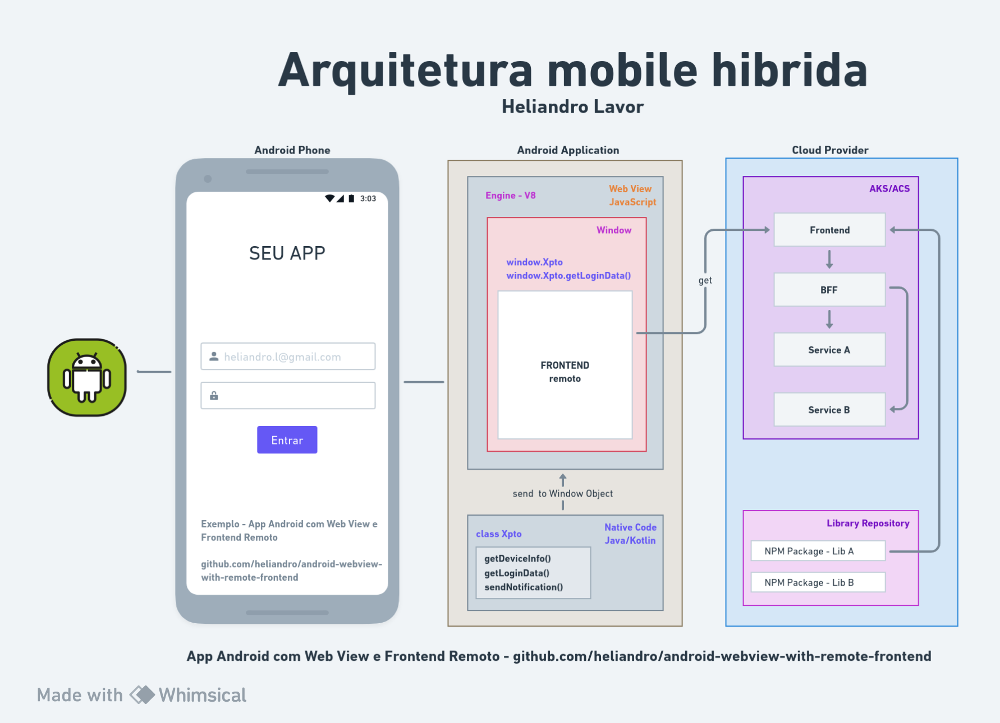

# Projeto Android Hibrido com o React

Este repositório contém as duas partes do projeto: a aplicação Android e o front-end React.

## Arquitetura da aplicação

obs: desconsiderar a parte do cloud provider. Este repositório só vai cobrir a interação entre o código nativo e o frontend em react.

## Aplicação Android

A pasta `android` contém a aplicação Android que se comunica com o front-end React através da WebView. A aplicação Android é responsável por renderizar a WebView e permitir a interação com o código nativo.

### Configuração

1. Abra o projeto Android no Android Studio ou sua IDE preferida.
2. Personalize a URL da WebView no arquivo `MainActivity.kt` para apontar para o endereço do servidor React rodando no container.

## Front-end

A pasta `frontend` contém o front-end desenvolvido em React. Ele apresenta um botão "Chamar função Toast nativa" que interage com o código nativo da aplicação Android.

### Configuração

1. Abra a pasta `frontend` em seu editor de código preferido.
2. Instale as dependências usando o comando `npm install`.
3. Inicie o servidor de desenvolvimento React com `npm start`.

Caso execute o docker-compose, não é necessário seguir os passos acima.

## Execução

1. Execute a aplicação Android no emulador ou dispositivo.
2. Certifique-se de que o container da aplicação frontend esteja rodando. Execute o comando `docker-compose up -d`
3. Acesse a URL da WebView no emulador ou dispositivo para interagir com o front-end React.
